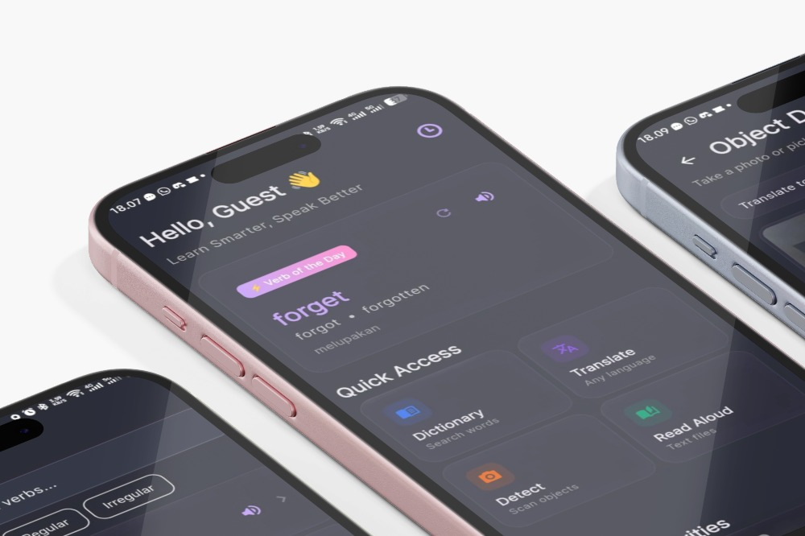
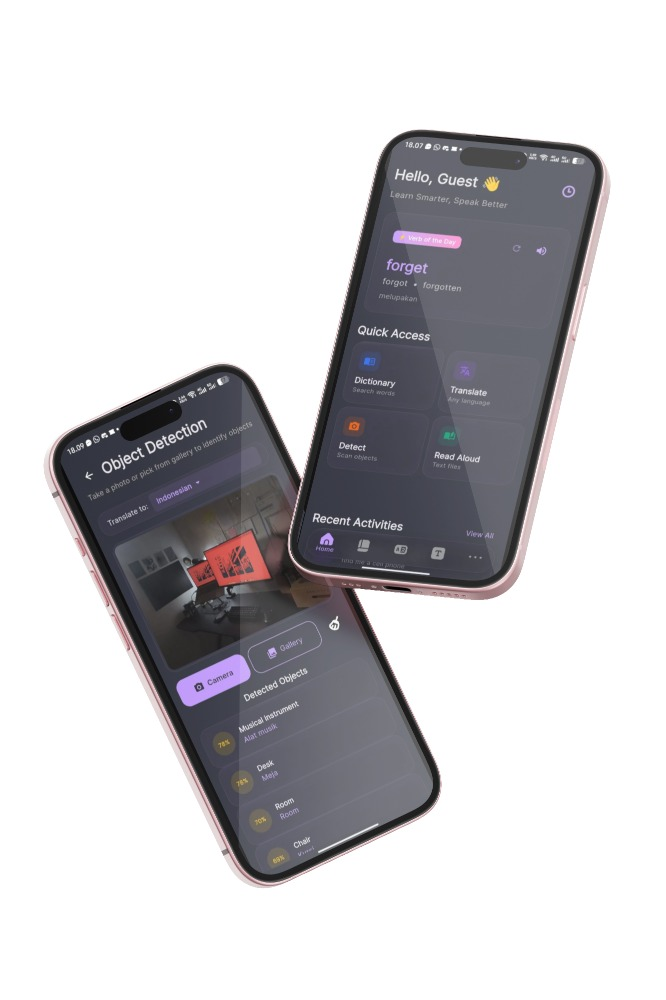

  

# About Verby

Welcome to Verby—a powerful and intuitive language tool engineered to simplify the complexities of vocabulary, verb conjugations, and translations. We believe that mastering a language should be an engaging and seamless experience.

Verby is built for anyone looking to elevate their linguistic skills, offering instant access to essential language resources right at your fingertips.

Core Features:

- Advanced Verb System: Dive deep into comprehensive verb conjugations, tenses, and practical usage examples to perfect your grammar.
- Integrated Dictionary: Instantly search and discover the precise meanings, synonyms, and contexts of words to build a richer vocabulary.
- Smart Translation: Overcome language barriers effortlessly with our quick and accurate translation tool.
- Personalized History: Easily revisit your past searches and translations to reinforce your learning and track your progress.
  Empower your communication and unlock new language capabilities with Verby—where words come to life.

## Screenshots

  

